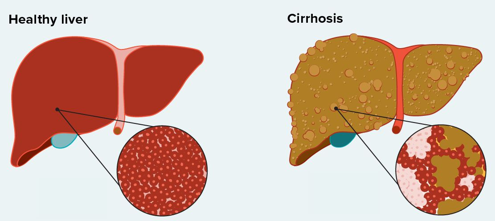

# Cirrhosis Outcome Prediction

## Summary

Cirrhosis, also known as liver cirrhosis or hepatic cirrhosis, and end-stage liver disease, is the impaired liver function caused by the formation of scar tissue known as fibrosis due to damage caused by liver disease.

## Description

This project involves predicting the outcomes of Cirrhosis patients based on various clinical and demographic features. Outcomes are classified as censored (C), alive due to liver transplant (CL), or deceased (D).
Dataset has been generated synthetically as part of [this dataset](https://www.kaggle.com/datasets/joebeachcapital/cirrhosis-patient-survival-prediction).

## Usage

- Open the `cirrhosis_outcome_prediction.ipynb` file using Jupyter Notebook.
- Run the notebook cells sequentially to see the classification process and outcomes of Cirrhosis patients.

